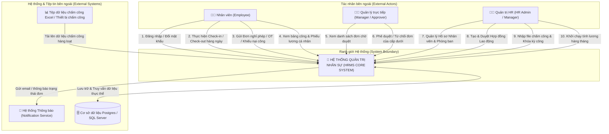
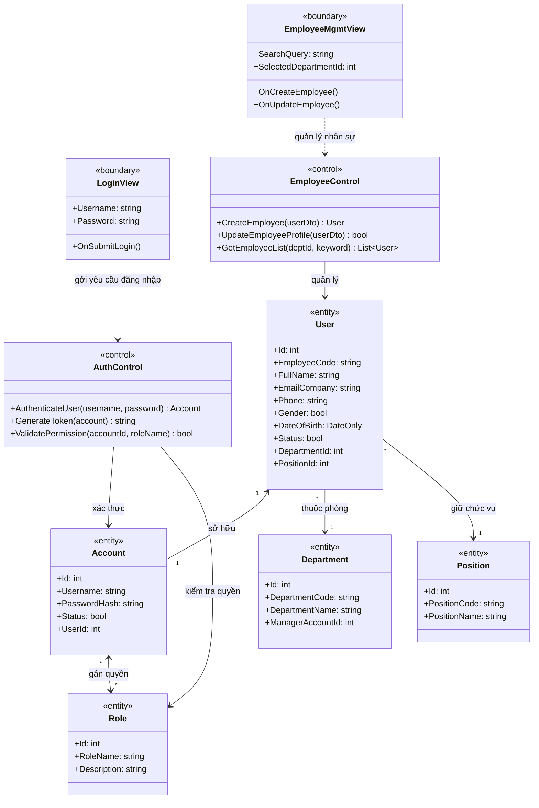
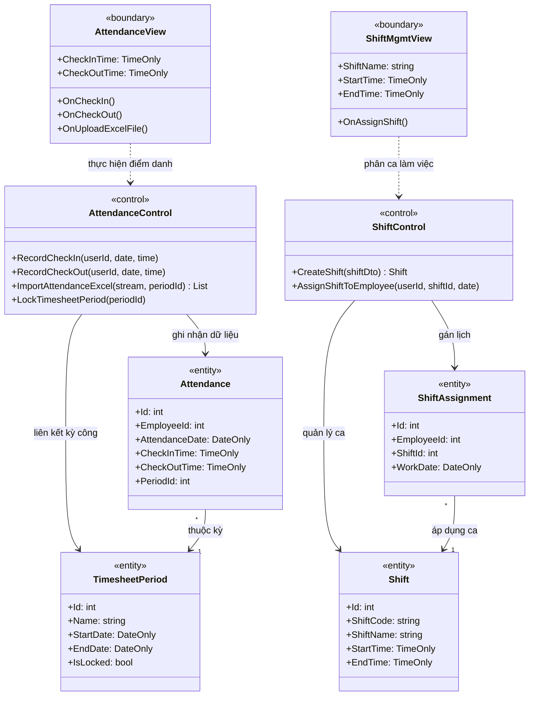
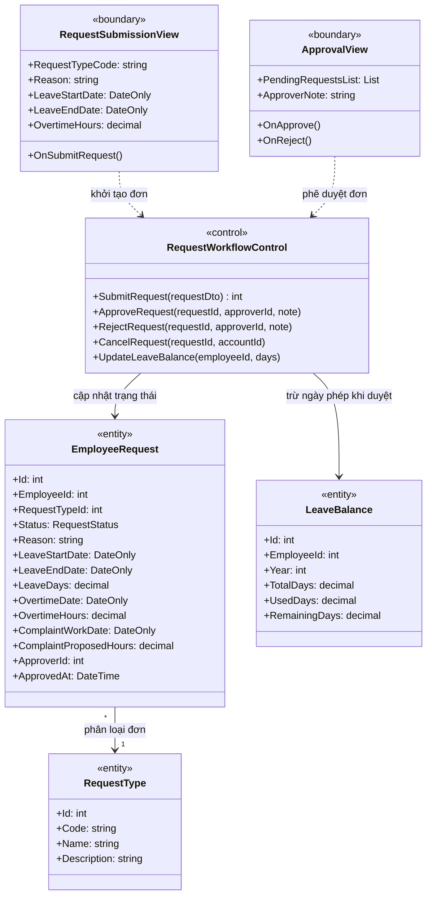
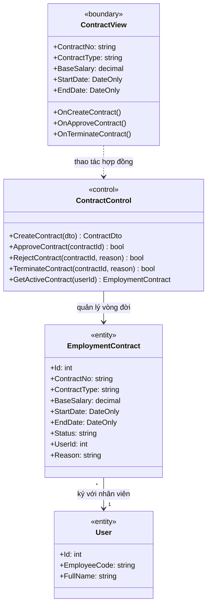
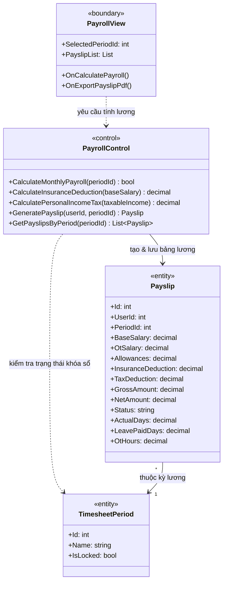
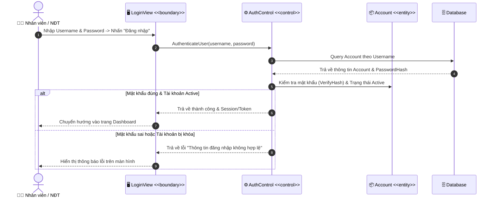
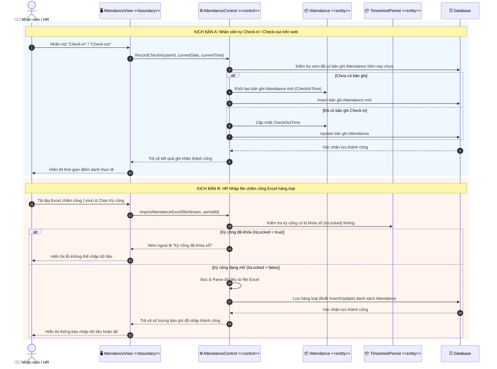
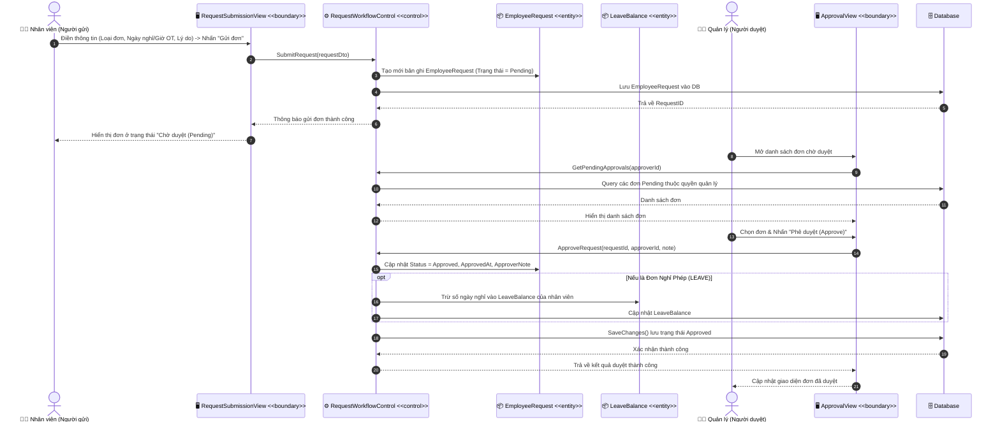
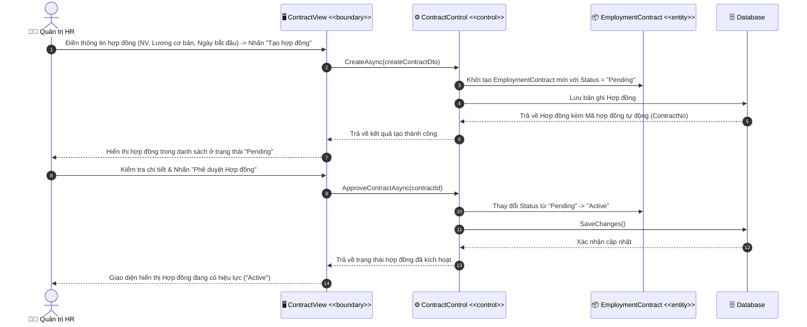

# TÀI LIỆU PHÂN TÍCH VÀ THIẾT KẾ HỆ THỐNG HRMS (HUMAN RESOURCE MANAGEMENT SYSTEM)
> **Phương pháp thiết kế**: Hassan Gomaa Design Method (COMET - Concurrent Object-Oriented Software Design)  
> **Phong cách**: Thiết kế khái niệm trước khi lập trình (Design-Before-Code), tập trung vào phân loại đối tượng (Stereotypes: `<<boundary>>`, `<<control>>`, `<<entity>>`) và rõ ràng luồng dữ liệu.

---

## MỤC LỤC
1. [Tổng quan Phương pháp Thiết kế Hassan Gomaa](#1-tổng-quan-phương-pháp-thiết-kế-hassan-gomaa)
2. [Sơ đồ Bối cảnh Hệ thống (System Context Diagram)](#2-sơ-đồ-bối-cảnh-hệ-thống-system-context-diagram)
3. [Sơ đồ Lớp các Tính năng Chính (Class Diagrams)](#3-sơ-đồ-lớp-các-tính-năng-chính-class-diagrams)
   - [Feature 1: Quản lý Xác thực & Tài khoản Nhân sự](#feature-1-quản-lý-xác-thực--tài-khoản-nhân-sự)
   - [Feature 2: Quản lý Chấm công & Ca làm việc](#feature-2-quản-lý-chấm-công--ca-làm-việc)
   - [Feature 3: Quy trình Gửi & Phê duyệt Đơn từ](#feature-3-quy-trình-gửi--phê-duyệt-đơn-từ)
   - [Feature 4: Quản lý Hợp đồng Lao động](#feature-4-quản-lý-hợp-đồng-lao-động)
   - [Feature 5: Quản lý & Tính Lương Hàng tháng](#feature-5-quản-lý--tính-lương-hàng-tháng)
4. [Sơ đồ Tuần tự các Tính năng Chính (Sequence Diagrams)](#4-sơ-đồ-tuần-tự-các-tính-năng-chính-sequence-diagrams)
   - [Sequence 1: Luồng Đăng nhập & Xác thực](#sequence-1-luồng-đăng-nhập--xác-thực)
   - [Sequence 2: Luồng Chấm công Hàng ngày & Nhập dữ liệu Excel](#sequence-2-luồng-chấm-công-hàng-ngày--nhập-dữ-liệu-excel)
   - [Sequence 3: Luồng Gửi & Duyệt Đơn (Nghỉ phép / OT / Khiếu nại công)](#sequence-3-luồng-gửi--duyệt-đơn-nghỉ-phép--ot--khiếu-nại-công)
   - [Sequence 4: Luồng Tạo & Phê duyệt Hợp đồng Lao động](#sequence-4-luồng-tạo--phê-duyệt-hợp-đồng-lao-động)
   - [Sequence 5: Luồng Tính Lương & Xuất Phiếu Lương Hàng tháng](#sequence-5-luồng-tính-lương--xuất-phiếu-lương-hàng-tháng)

---

## 1. TỔNG QUAN PHƯƠNG PHÁP THIẾT KẾ HASSAN GOMAA

Phương pháp **Hassan Gomaa** trong thiết kế hướng đối tượng chú trọng phân tách hệ thống thành các nhóm đối tượng có vai trò rõ ràng (Stereotypes):
1. **`<<boundary>>` (Đối tượng Biên / Giao diện)**: Đóng vai trò trung gian tương tác với tác nhân bên ngoài (Người dùng, Hệ thống ngoài). Nhận yêu cầu và hiển thị kết quả.
2. **`<<control>>` (Đối tượng Điều khiển / Điều phối)**: Quản lý luồng nghiệp vụ, thực thi logic trung gian, phối hợp tương tác giữa đối tượng giao diện và các thực thể dữ liệu.
3. **`<<entity>>` (Đối tượng Thực thể / Dữ liệu)**: Đại diện cho các khái niệm nghiệp vụ lõi và lưu trữ trạng thái của hệ thống (User, Attendance, Request, Contract, Payslip,...).

---

## 2. SƠ ĐỒ BỐI CẢNH HỆ THỐNG (SYSTEM CONTEXT DIAGRAM)

Sơ đồ bối cảnh thể hiện ranh giới của hệ thống **HRMS System** cùng với các tác nhân (Actors) và hệ thống bên ngoài tương tác qua lại.



---

## 3. SƠ ĐỒ LỚP CÁC TÍNH NĂNG CHÍNH (CLASS DIAGRAMS)

Các sơ đồ lớp được thiết kế theo phong cách Hassan Gomaa, chia rõ thành 3 tầng: `<<boundary>>`, `<<control>>`, và `<<entity>>`.

### Feature 1: Quản lý Xác thực & Tài khoản Nhân sự

Quản lý đăng nhập, phân quyền người dùng (`Admin`, `HR`, `Manager`, `Employee`), thông tin phòng ban và chức danh.



---

### Feature 2: Quản lý Chấm công & Ca làm việc

Quản lý lịch trình làm việc, phân ca, ghi nhận check-in/check-out hàng ngày và nhập dữ liệu bảng công từ file Excel.



---

### Feature 3: Quy trình Gửi & Phê duyệt Đơn từ

Quản lý vòng đời đơn của nhân viên (Nghỉ phép, Làm thêm giờ OT, Khiếu nại điều chỉnh công) qua các trạng thái: `Draft` -> `Pending` -> `Approved` / `Rejected` / `Cancelled`.



---

### Feature 4: Quản lý Hợp đồng Lao động

Tạo lập, phê duyệt, gia hạn và chấm dứt hợp đồng lao động giữa công ty và nhân viên.



---

### Feature 5: Quản lý & Tính Lương Hàng tháng

Tổng hợp công thực tế, giờ OT duyệt, ngày nghỉ phép hưởng lương, tính bảo hiểm (BHXH 10.5%), thuế TNCN lũy tiến từng phần để xuất phiếu lương (`Payslip`).



---

## 4. SƠ ĐỒ TUẦN TỰ CÁC TÍNH NĂNG CHÍNH (SEQUENCE DIAGRAMS)

Các sơ đồ tuần tự thể hiện rõ nét sự tương tác giữa các lớp `<<boundary>>`, `<<control>>`, `<<entity>>` và `Database` theo thời gian.

### Sequence 1: Luồng Đăng nhập & Xác thực



---

### Sequence 2: Luồng Chấm công Hàng ngày & Nhập dữ liệu Excel



---

### Sequence 3: Luồng Gửi & Duyệt Đơn (Nghỉ phép / OT / Khiếu nại công)



---

### Sequence 4: Luồng Tạo & Phê duyệt Hợp đồng Lao động



---

### Sequence 5: Luồng Tính Lương & Xuất Phiếu Lương Hàng tháng

```mermaid
sequenceDiagram
    autonumber
    actor HR as 👩‍💼 Quản trị HR
    participant View as 🖥️ PayrollView <<boundary>>
    participant Ctrl as ⚙️ PayrollControl <<control>>
    participant PeriodEntity as 📦 TimesheetPeriod <<entity>>
    participant DB as 🗄️ Database
    participant SlipEntity as 📦 Payslip <<entity>>

    HR->>View: Chọn Kỳ công (Month/Year) & Nhấn "Tính lương hàng tháng"
    View->>Ctrl: CalculateMonthlyPayrollAsync(periodId)
    Ctrl->>PeriodEntity: Kiểm tra xem Kỳ công đã được khóa sổ (IsLocked) chưa?
    
    alt Kỳ công chưa khóa sổ
        Ctrl-->>View: Lỗi "Vui lòng khóa kỳ công trước khi tính lương!"
        View-->>HR: Thông báo yêu cầu khóa kỳ công trước
    else Kỳ công đã khóa sổ thành công
        Ctrl->>DB: Lấy danh sách Nhân viên Active
        Ctrl->>DB: Lấy danh sách Hợp đồng Active (để lấy BaseSalary)
        Ctrl->>DB: Lấy dữ liệu Chấm công thực tế trong kỳ (D_actual)
        Ctrl->>DB: Lấy các Đơn Nghỉ phép (D_leave) & OT (H_ot) đã Approved
        
        loop Đối với từng Nhân viên
            Ctrl->>Ctrl: 1. Đơn giá ngày công = BaseSalary / StandardWorkingDays
            Ctrl->>Ctrl: 2. Lương công thực tế = Đơn giá * (D_actual + D_leave)
            Ctrl->>Ctrl: 3. Tiền OT = H_ot * (HourlyRate * 1.5)
            Ctrl->>Ctrl: 4. Tổng thu nhập (Gross) = Lương công + Tiền OT + Phụ cấp
            Ctrl->>Ctrl: 5. Bảo hiểm bắt buộc = Min(BaseSalary, Trần BH) * 10.5%
            Ctrl->>Ctrl: 6. Thu nhập chịu thuế = Gross - Bảo hiểm - 11,000,000 VNĐ
            Ctrl->>Ctrl: 7. Thuế TNCN lũy tiến = Biểu thuế lũy tiến từng phần
            Ctrl->>Ctrl: 8. Lương thực lĩnh (Net) = Gross - Bảo hiểm - Thuế TNCN
            Ctrl->>SlipEntity: Khởi tạo bản ghi Payslip mới
        end

        Ctrl->>DB: Ghi đè / Xóa phiếu lương cũ của kỳ & Lưu danh sách Payslip mới
        DB-->>Ctrl: Xác nhận lưu bảng lương thành công
        Ctrl-->>View: Trả về kết quả hoàn tất tính lương
        View-->>HR: Hiển thị bảng danh sách Phiếu lương hàng tháng của toàn bộ công ty
    end
